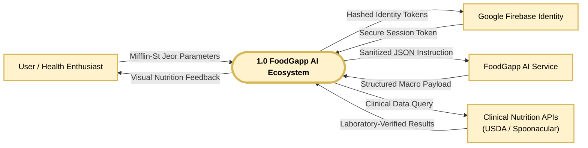
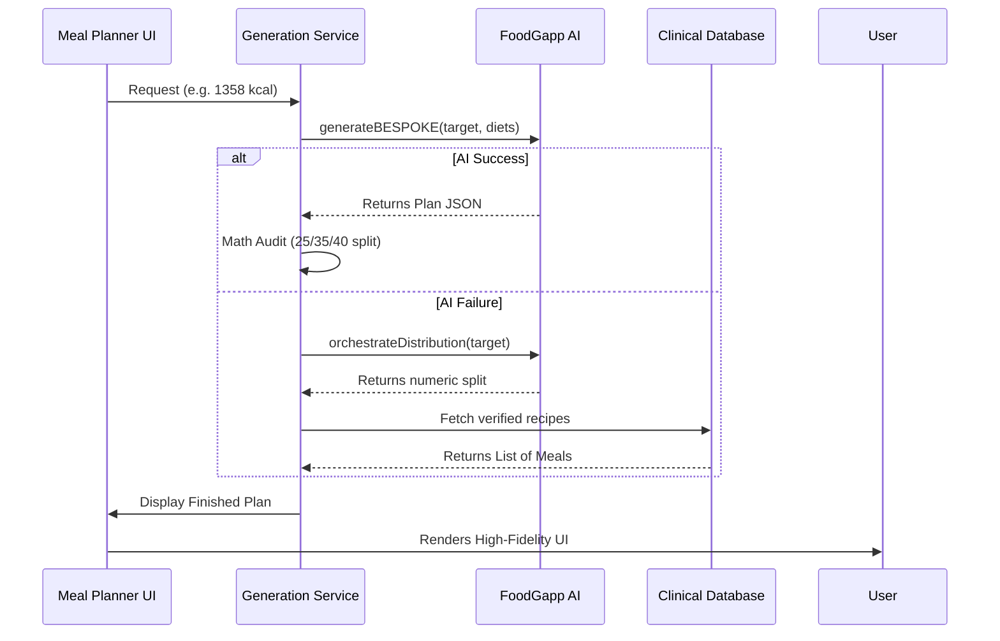

# 📊 FoodGapp Master Technical Data Flow Diagrams (DFD)

This document contains industry-standard Data Flow Diagrams for **FoodGapp v1.1.8**, strictly utilizing **Gane-Sarson engineering notation**. These visuals illustrate the system boundaries, functional decomposition, and complex data orchestration.

---

## 🌐 DFD Level 0: Context Diagram
Defines the absolute system boundary and high-level interaction with external entities.

---

## ⚙️ DFD Level 1: Internal Process Architecture
Decomposes the system into functional processes, identifying precise data movement between the application logic and the **v25 SQLite Persistent Storage**.

```mermaid
graph TD
    %% Styling
    classDef entity fill:#FFF2CC,stroke:#d6b656,stroke-width:2px,color:#000;
    classDef process fill:#FFF2CC,stroke:#d6b656,stroke-width:3px,color:#000;
    classDef store fill:#FFF2CC,stroke:#d6b656,stroke-width:2px,color:#000;

    %% Entities
    User[User]
    Firebase[Firebase Identity]
    AI_Service[FoodGapp AI Service]
    Clinical_API[Clinical Nutrition APIs]

    %% Processes
    subgraph "Functional Process Layer"
        P1(["1.1 Manage Biometrics & Auth"])
        P2(["1.2 Process AI 'Magic Log' Intake"])
        P3(["1.3 Orchestrate AI Meal Planning"])
        P4(["1.4 Generate Grocery Shopping List"])
        P5(["1.5 Execute High-Speed Library Search"])
        P6(["1.6 Perform v5 Structural Audit"])
        P7(["1.7 Orchestrate Biological Fasting"])
    end

    %% Stores
    D1["D1: User Biometric Profiles"]
    D2["D2: Daily Nutritional Logs"]
    D3["D3: Titan Local Encyclopedia"]
    D4["D4: Active Meal Plan Snapshots"]
    D5["D5: Consolidated Shopping List"]
    D6["D6: Biological Fasting Records"]

    %% 1.1 Flow
    User -- "Mifflin-St Jeor Parameters" --> P1
    P1 -- "Hashed Tokens" --> Firebase
    Firebase -- "Session Token" --> P1
    P1 -- "Update Record" --> D1
    D1 -- "Nutritional Profile" --> P1
    P1 -- "PDRI Targets" --> User

    %% 1.2 Flow
    User -- "Natural Language Text" --> P2
    P2 -- "Sanitized Instruction" --> AI_Service
    AI_Service -- "Structured Macros" --> P2
    P2 -- "Persist Transaction" --> D2
    D2 -- "Historical Trend Data" --> P2
    P2 -- "Nutrition Feedback" --> User

    %% 1.3 Flow
    User -- "Orchestration Request" --> P3
    D1 -- "Calculated Targets" --> P3
    P3 -- "Plan Instruction" --> AI_Service
    P3 -- "Clinical Query" --> Clinical_API
    AI_Service -- "Bespoke Recipes" --> P3
    Clinical_API -- "Verified Macros" --> P3
    P3 -- "Save Snapshot" --> D4
    P3 -- "7-Day AI Menu" --> User

    %% 1.4 Flow
    D4 -- "Active Ingredient List" --> P4
    P4 -- "Aisle Mapping Request" --> AI_Service
    AI_Service -- "Heuristic Aisle Mapping" --> P4
    P4 -- "Update Inventory" --> D5
    D5 -- "Consolidated List" --> User

    %% 1.5 Flow
    User -- "Search Keywords" --> P5
    P5 -- "Keyword Intersection" --> D3
    D3 -- "Sub-10ms Verified Items" --> P5
    P5 -- "API Backup Request" --> Clinical_API
    Clinical_API -- "Verified Data" --> P5
    P5 -- "Food Matches" --> User

    %% 1.6 Flow (Self-Healing)
    P6 -- "Structural Audit (v5)" --> D1
    P6 -- "Structural Audit (v5)" --> D2
    P6 -- "Structural Audit (v5)" --> D5
    D1 -- "Table Corruption Alert" --> P6
    P6 -- "Schema Restoration" --> D1

    %% 1.7 Flow
    User -- "Timer Commencement" --> P7
    P7 -- "Session Log" --> D6
    D6 -- "Fasting History" --> P7
    P7 -- "Biological Stage Info" --> User

    class User,Firebase,AI_Service,Clinical_API entity;
    class P1,P2,P3,P4,P5,P6,P7 process;
    class D1,D2,D3,D4,D5,D6 store;
```

---

## 🧠 DFD Level 2: AI Planning Sequence
Illustrates the data handshake during high-accuracy meal generation.

