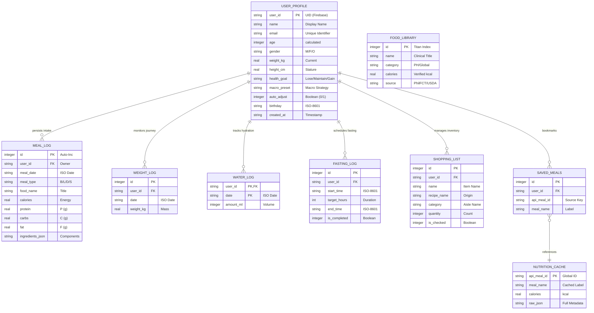
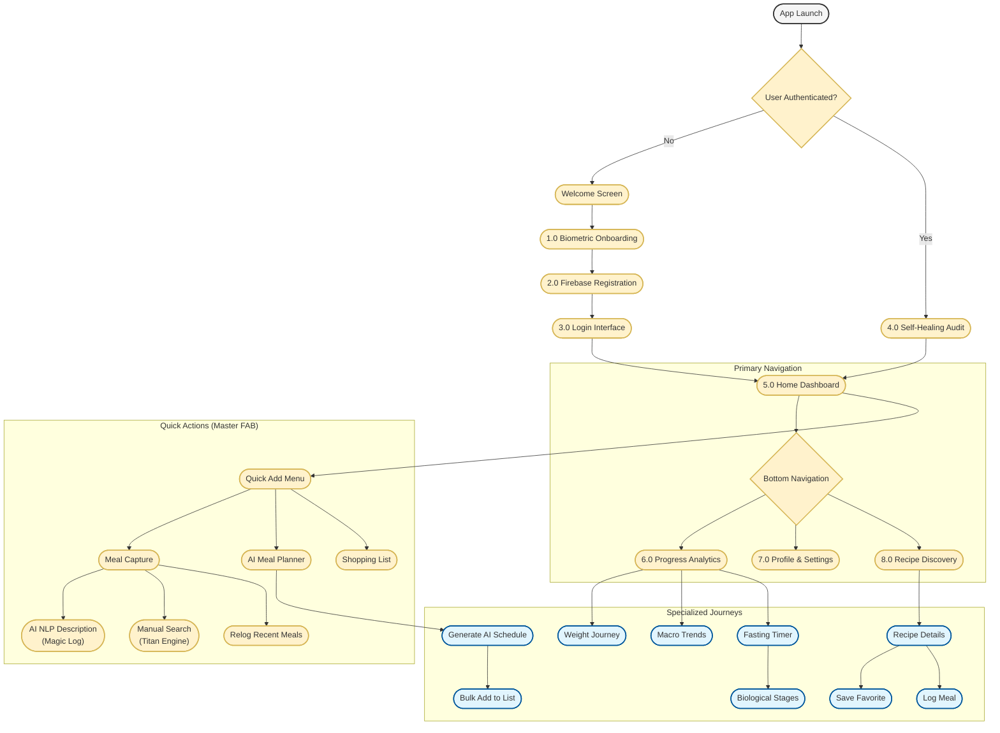
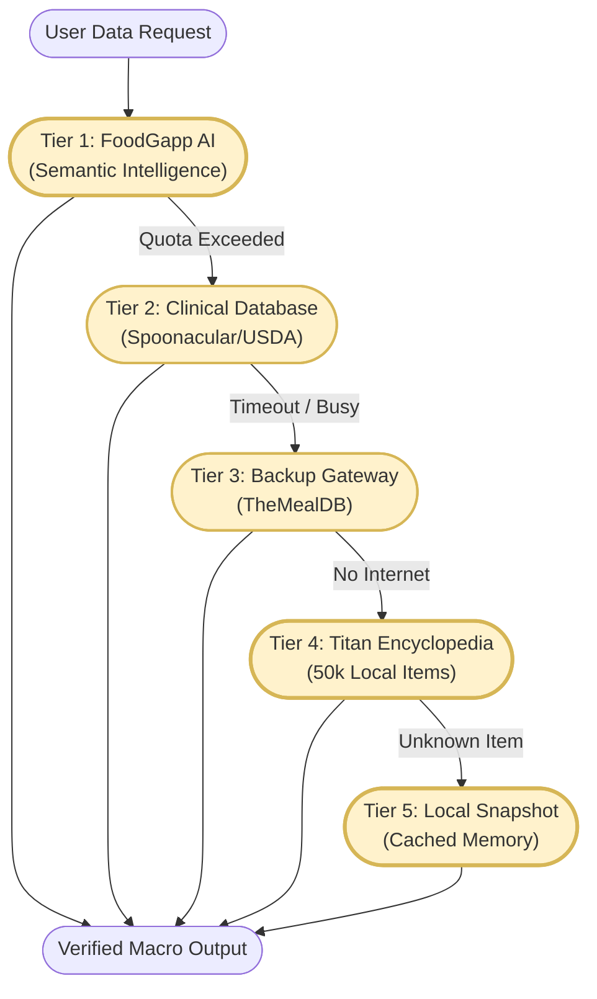

# 💎 FoodGapp Technical Visual Dossier (Professional Edition)

This dossier contains secondary technical visuals for the **FoodGapp Capstone Defense**, focusing on data relationships (ERD), system resilience (Gateway), and the master functional flowchart.

---

## 🗄️ 1. Entity-Relationship Diagram (ERD) - SQLite v25
An industry-standard technical map of the relational schema using **Crow's Foot notation**.

---

## 🚀 2. System Functional Flowchart (Comprehensive Journey)
This flowchart illustrates the complete operational lifecycle of FoodGapp, from the initial authentication handshake to the specialized tracking "Journeys."

---

## 🛡️ 3. The 5-Layer Data Resilience Gateway
Visualizes the application's unique hierarchical fail-over logic, ensuring 100% operational uptime.

---
> [!IMPORTANT]
> **Defense Talking Point**: "By combining a centralized **Star Schema ERD** with a **5-Layer Resilience Gateway**, we ensure that the user journey remains uninterrupted even in offline environments, while maintaining clinical-grade data integrity."
